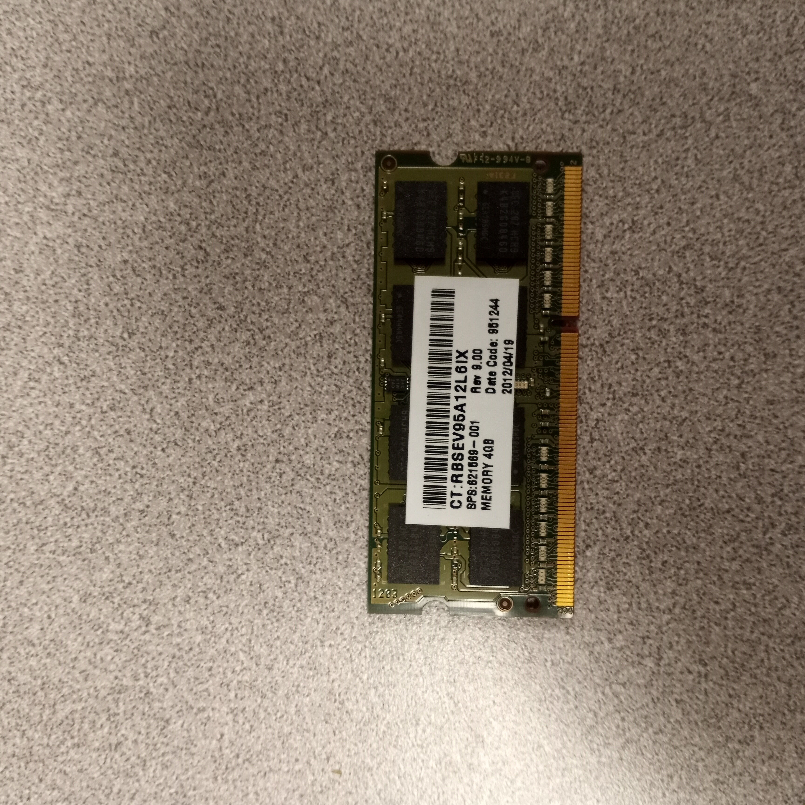

# 3.2 Installing RAM and different RAM types
## Overview
RAM (Random-Access Memory) is a form of memory for computers to read and store data in any order temporarily. It is typically used to store working data and machine code.

Not all RAM look the same however. Different types of RAM exist for different systems. For example, SODIMMs are the type of RAM commonly found in laptops for their small form factor.
Different types of RAM can be told apart by their shape and notch position.

## SODIMM

A picture of a SODIMM

SODIMMs (Small Outline Dual Inline Memory Modules) are a compact form factor of RAM commonly used in laptops, small-form-factor desktops, and other space-constrained devices. They are smaller and thinner than standard DIMMs, making them ideal for portable devices where conserving space is essential. SODIMMs typically come in configurations like DDR4, DDR5, or earlier versions, providing a balance of performance and efficiency to suit various computing needs. Their compact design allows for straightforward upgrades and replacements in compatible systems.

They are installed into a system often by being pushed down into the slot until it clicks. Make sure first that the RAM is supported by your laptop and the notch is in the correct position. The notch is the little bit where pins are missing. The notch position is what sets DDR1, 2, 3, 4, and 5 apart, meaning that if the notch isn't in the right place that RAM isn't supported. If tbe RAM doesn't smoothly insert into the slot, ***do not try to force it***. Check the notch position on the board and on your RAM and make sure it is compatible. This applies for any RAM, not just SODIMMs.